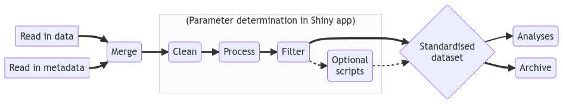
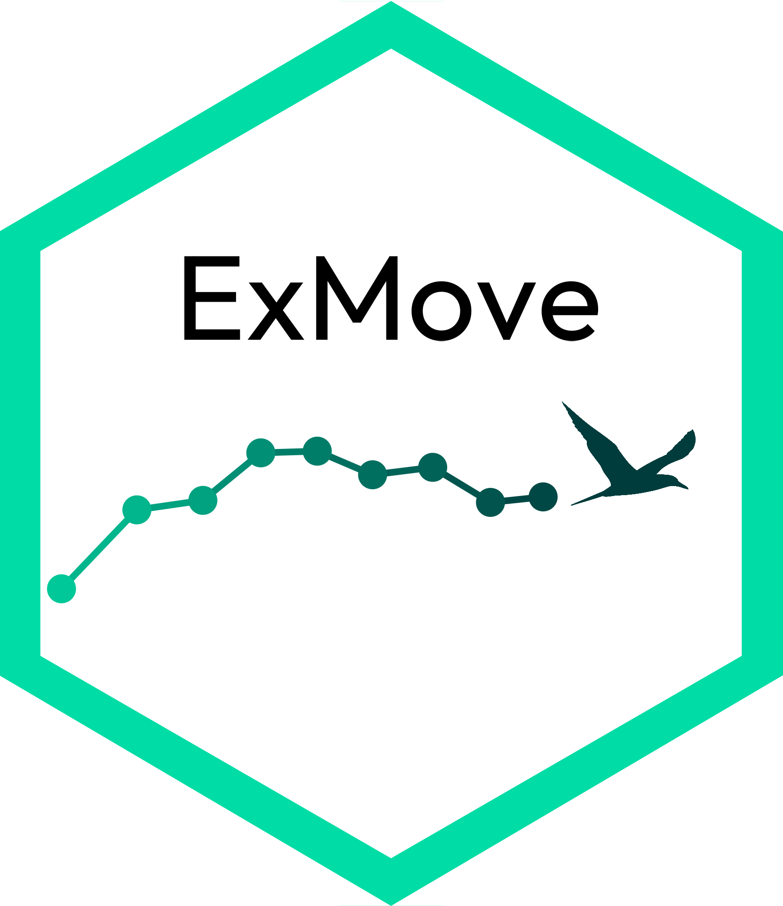

Alongside Liam Langley, Stephen Lang, & Luke Ozsanlav-Harris, we have created a toolkit for processing biologging data from tag downloads to online archive. All resources and code can be accessed via the [ExMove website](https://exmove.github.io/) and [GitHub repository](https://github.com/ExMove/ExMove).

**Aims:**

-   Collate and process raw data from tracking devices, such as GPS, GLS and Argos, into a standardised data set for analyses and archiving in online tracking databases.

-   Facilitate robust data cleaning by providing an interactive shiny app to aid parameter determination and visualisation.

-   Generate a learning tool for users to develop skills in animal movement analysis.

-   Maximize stability by using a few well-maintained core R packages, including here, tidyverse and sf.

-   Provide open source code, the initial steps of which can be adapted for biologging studies, such as merging and standardizing additional sensor data (e.g., immersion/TDR) from multiple individuals.

:::: {.callout-tip collapse="true" appearance="minimal"}
##### Key publications

::: {style="font-size:16px"}
[@langley2024a]
:::
::::

::: {layout-ncol="3"}
{width="30%"}
:::

