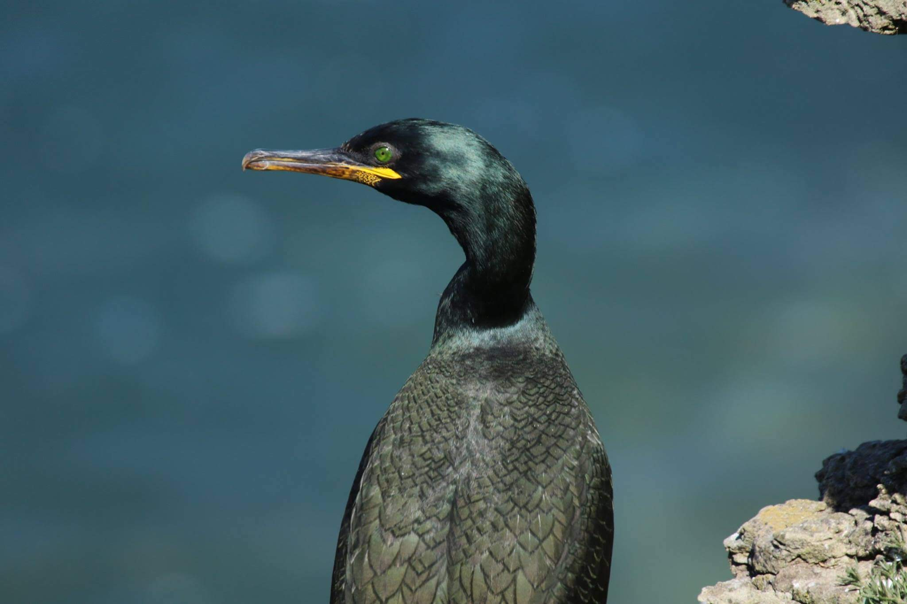

The Isles of Scilly is an archipelago off the South-West UK, home to an internationally important assemblage of 13 seabird species. Our project uses seabirds as indicators of ecosystem health, and aims to quantify seabirds' role as ecosystem engineers, to tackle key threats to their breeding success: invasive predators and climate- and fisheries-induced changes in prey availability.

This ongoing project is a collaboration with the Isles of Scilly Wildlife Trust, the Isles of Scilly Inshore Fisheries and Conservation Authority, Natural England, and the RSPB.

**Aims:**

-   To understand the at-sea distributions of seabirds and their prey fish on the Isles of Scilly to inform their spatial protection. Led by PhD student Sabiya Sheikh.

-   To understand the role of Isles of Scilly seabirds as ecosystem engineers to inform future restoration actions

::: {layout-ncol="3"}
{width="30%"}
:::

