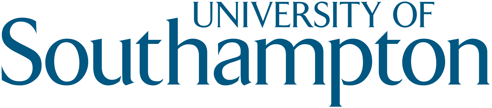
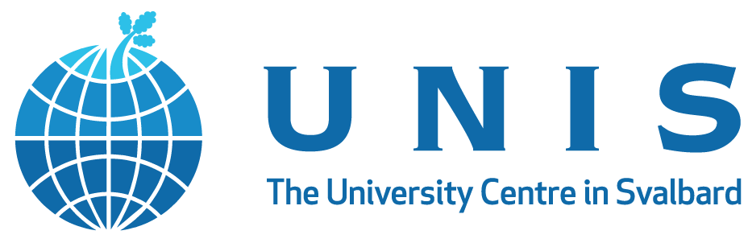
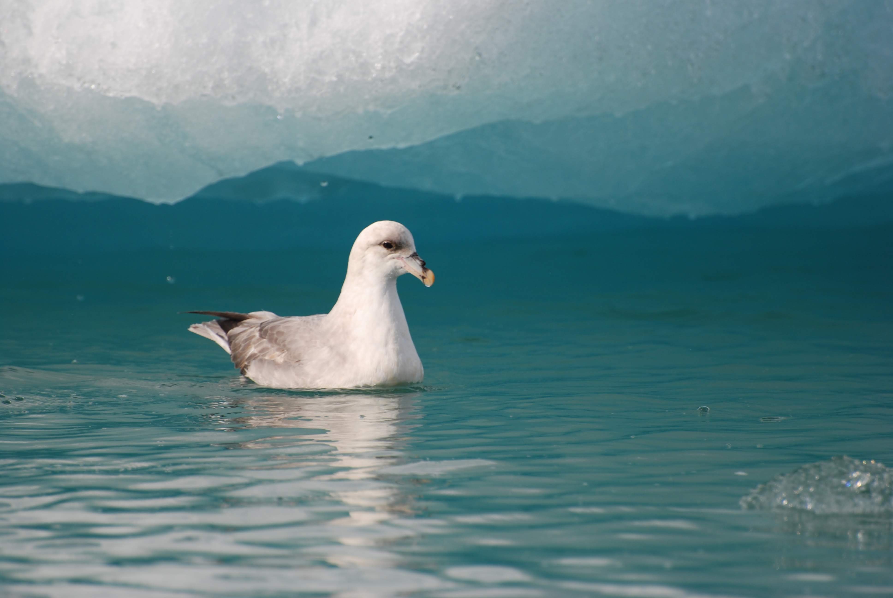

Monitoring plastic ingestion by northern fulmars, *Fulmaris glacialis*, in the Norwegian high Arctic, during my MSci at the University of Southampton.

**Key findings:**

-   Arctic marine litter levels were higher than expected from regional trends, and exceeded the ecological quality objective defined by OSPAR for European seas.

-   Highlighted the value of seabirds as bio-indicator species within marine policy, the connectivity of the global oceans, and the need for urgent regulation of plastic pollution in the Arctic

-   Contributed to ongoing monitoring and recommendation of standardised methods for quantifying debris ingestion in marine megafauna

:::: {.callout-tip collapse="true" appearance="minimal"}
##### Key publications

::: {style="font-size:16px"}
[@trevail_elevated_2015]

[@provencher_quantifying_2017]
:::
::::

::: {layout-ncol="3"}
{width="30%"} {width="30%"}
:::

