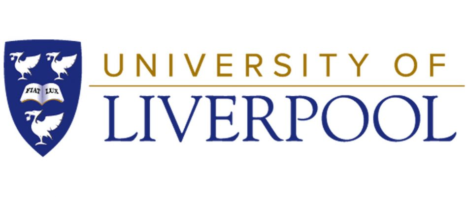
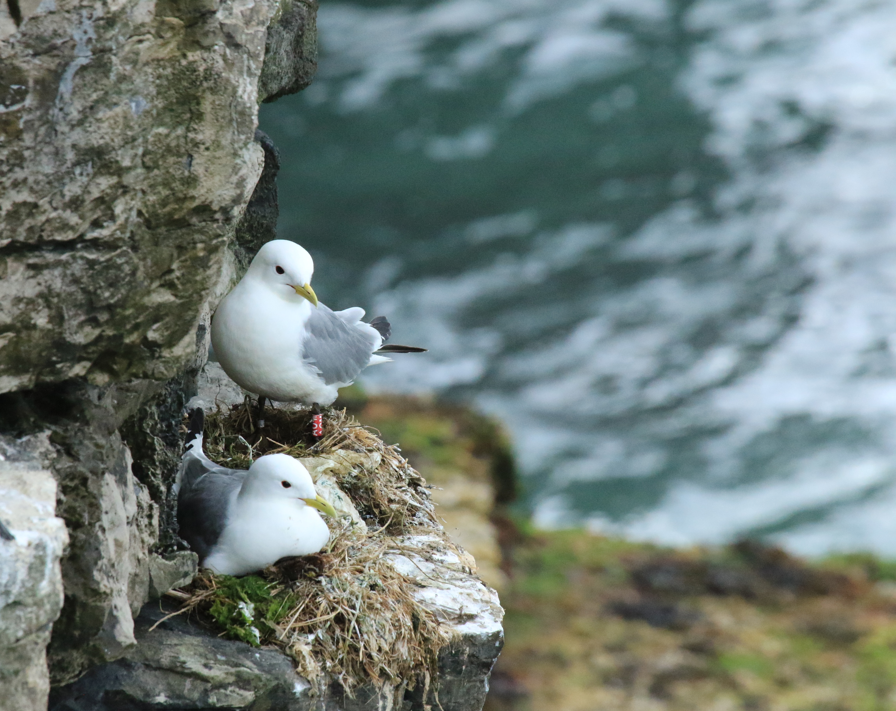

I explored the influence of environmental heterogeneity, as a proxy for resource patchiness, on black-legged kittiwake, *Rissa tridactyla*, habitat selection, individual consistency, and reproductive success, during my PhD at the University of Liverpool.

**Key findings:**

-   Environmental heterogeneity most likely clusters resources into discrete patches. This provides foraging opportunity, creates competition among individuals with negative consequences for reproductive success and promotes individual specialisation in habitat selection.

-   Contributed to review of optimising biologging methods

:::: {.callout-tip collapse="true" appearance="minimal"}
##### Key publications

::: {style="font-size:16px"}
[@trevail_environmental_2019-1]

[@trevail_environmental_2019]

[@trevail_environmental_2021]

[@williams_optimizing_2020]
:::
::::

::: {layout-ncol="3"}
{width="30%"}

{width="30%"}
:::

