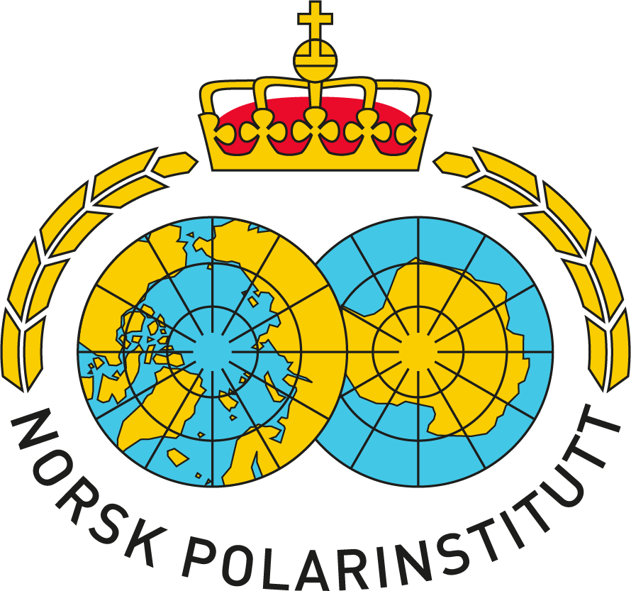
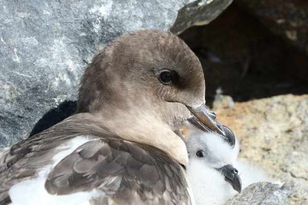

I joined the Norwegian Polar Institute on expeditions to the Antarctic ([Tor field station](https://www.npolar.no/en/tor/)) and Arctic (Svalbard) to help with regular seabird monitoring, and foraging ecology studies.

**Key findings:**

-   Prey density effects predator foraging strategies, most likely via group vigilance and defense

-   Individual foraging strategy is linked to diet in Antarctic petrels, with implications for population resiliance to climate change and fishery impacts

:::: {.callout-tip collapse="true" appearance="minimal"}
##### Key publications

::: {style="font-size:16px"}
[@busdieker_prey_2020]

[@descamps_variation_2022]
:::
::::

::: {layout-ncol="3"}
{width="30%"}
:::

