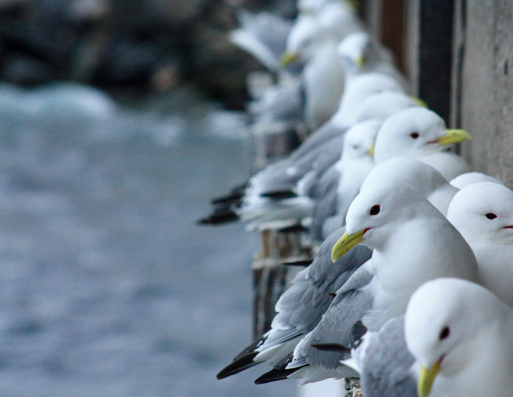

The now Critically Endangered Black-legged kittiwake, *Rissa tridactyla*, has experienced widespread declines across the UK. Conservation focus is shifting offshore amid marine renewable developments that require impact assessment and offsetting, and the decommissioning and re-purposing of end-of-life oil and gas platforms. Offshore structures could support a significant kittiwake breeding population, not currently included in current population estimates.

**Aims:**

-   To understand the importance of offshore oil rigs as breeding habitats for kittiwakes. Multiple projects led by former UoE masters student Anna Lowden and current UoE PhD student Debs Allbrook.

-   To understand year-round distributions of the North Atlantic kittiwake metapopulation to inform future offshore renewable consenting. Led by PhD student Vance Mak

:::: {.callout-tip collapse="true" appearance="minimal"}
##### Key publications

::: {style="font-size:16px"}
[@delahay2025]
:::
::::

::: {layout-ncol="3"}
{width="30%"}
:::

